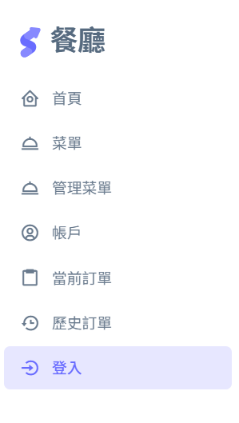
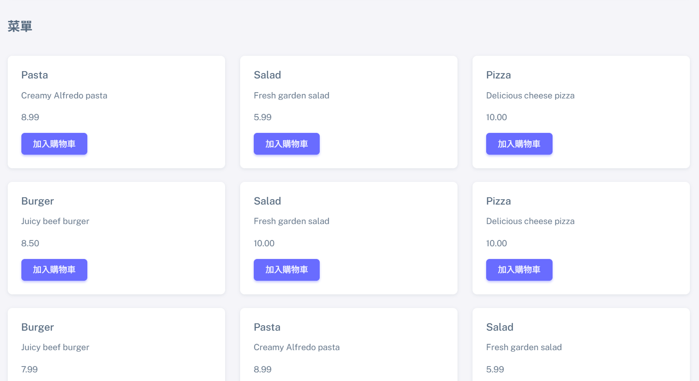
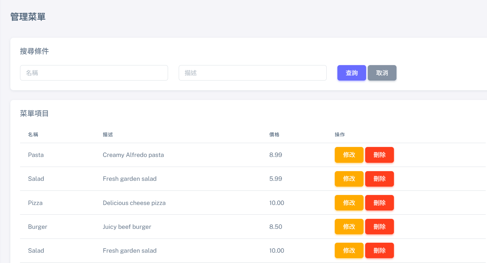
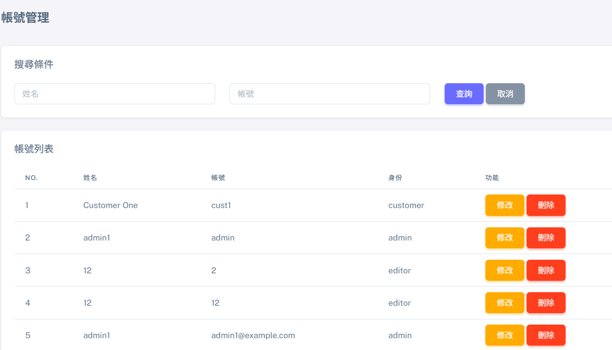

# 🍽️ Restaurant Management System

A web-based restaurant ordering and management system developed with PHP and MySQL.

## Features

### Customer

- User registration and authentication
- Browse restaurant menu
- Add items to shopping cart
- Submit orders
- View order history

### Administrator

- Account management
- Menu management with CRUD operations
- Current order management
- Update order status
- View completed orders

## Tech Stack

- PHP
- MySQL
- HTML5
- CSS3
- JavaScript
- Bootstrap
- XAMPP

## Screenshots

### Login


### Dashboard



### Menu



### Shopping Cart


### Order Management



### Account Management



## Project Structure

```text
restaurant-management-system/
├── assets/          # CSS, JavaScript, images and UI libraries
├── config/          # Database configuration template
├── database/        # MySQL database export
├── includes/        # Shared header and footer
├── models/          # Database access functions
├── public/          # Application pages
├── screenshots/     # Project screenshots
├── index.php        # Application entry point
└── README.md
```

## Installation

1. Install and start Apache and MySQL using XAMPP.
2. Clone or download this repository.
3. Place the project inside the XAMPP `htdocs` directory.
4. Import the SQL file from the `database` directory into phpMyAdmin.
5. Copy:

```text
config/config.example.php
```

and rename it to:

```text
config/config.php
```

6. Update the database settings in `config/config.php`.
7. Open the application:

```text
http://localhost/restaurant-management-system/
```

## Security

- Passwords are stored using PHP password hashing.
- Database credentials are excluded from Git using `.gitignore`.
- A configuration example is included for local installation.

## Author

CHI-CHUN TU